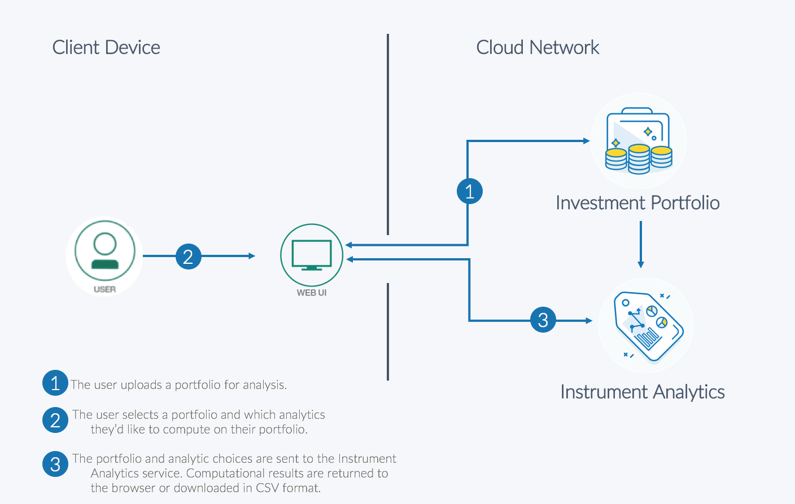

# Portfolio Analytics Computation

## Upload a portfolio and compute analytics on it

This journey leverages two services:
- The **Investment Portfolio service** is used to manage and store portfolios and financial security information such as the set of eligible investments, benchmarks, and user portfolios.
- The **Instruments Analytics service** is used to compute analytics on securities. This service is pre-integrated with market data and leverages a wide set of financial models. These financial models are _cashflow generation models_, meaning they project all cash flow a given security is going to make over its lifespan in order to calculate properties of financial securities such as current value (using present value of the cash flows) or sensitivities (to see how much cashflows change when incremental changes are made to various model inputs).

When the reader has completed this journey, they will understand how to:

* Load and retrieve data from the Investment Portfolio service
* Construct a payload to generate analytics on a portfolio
* Construct a user interface to display results, or download to a CSV file.

<p align="center">
  
</p>

## Included Components
+ Bluemix Investment Portfolio
+ Bluemix Instrument Analytics

## Steps

Use the ``Deploy to Bluemix`` button **OR** create the services and run ``Run Locally``.

## Deploy to Bluemix

[](https://bluemix.net/devops/setup/deploy?repository=https://github.com/SeidProjects/Portfolio.Compute)

## Running the Application Locally
Follow these steps to setup and run this developer journey. The steps are described in detail below.

## Prerequisites
- [Python](https://www.python.org/downloads/)

## Steps to run locally
1. [Clone the repo](#1-clone-the-repo)
2. [Create Bluemix services](#2-create-bluemix-services)
3. [Configure Manifest file](#3-configure-manifest)
4. [Configure .env file](#4-configure-env-file)
5. [Run Application](#5-run-application)
6. [Uploading Holdings](#6-upload-holdings)
7. [Compute Analytics](#7-compute-analytics)

## 1. Clone the repo

Clone the `Build-an-optimal-investment-portfolio code` locally. In a terminal, run:

  `$ git clone https://github.com/SeidProjects/Portfolio.Compute`

## 2. Create Bluemix services

Create the following services:

* [**Investment Portfolio**](https://console.ng.bluemix.net/catalog/services/investment-portfolio)
* [**Instrument Analytics**](https://console.bluemix.net/catalog/services/instrument-analytics)

## 3. Configure Manifest file

Edit the `manifest.yml` file in the folder that contains your code and replace with a unique name for your application. The name that you specify determines the application's URL, such as `your-application-name.mybluemix.net`. Additionally - update the service names so they match what you have in Bluemix. The relevant portion of the `manifest.yml` file looks like the following:

  ```none
  declared-services:
    Investment-Portfolio:
      label: fss-portfolio-service
      plan: fss-portfolio-service-free-plan
    Instrument-Analytics:
      label: fss-instrument-analytics-service
      plan: fss-instrument-analytics-service-free-plan
  applications:
  - path: .
    memory: 128M
    instances: 1
    name: Portfolio-Compute
    disk_quota: 1024M
    domain: mybluemix.net
    services:
    - Investment-Portfolio
    - Instrument-Analytics
    buildpack: python_buildpack
  ```

## 4. Configure .env file

Create a `.env` file in the root directory of your clone of the project repository by copying the sample `.env.example` file using the following command:

  ```none
  cp .env.example .env
  ```

  **NOTE** Most files systems regard files with a "." at the front as hidden files.  If you are on a Windows system, you should be able to use either [GitBash](https://git-for-windows.github.io/) or [Xcopy](https://www.microsoft.com/resources/documentation/windows/xp/all/proddocs/en-us/xcopy.mspx?mfr=true)

You will need to update the credentials with the Bluemix credentials for each of the services you created in [Step 2](#2-create-bluemix-services).

The `.env` file will look something like the following:

  ```none
# Investment Portfolio
CRED_PORTFOLIO_USERID_W=
CRED_PORTFOLIO_PWD_W=
CRED_PORTFOLIO_USERID_R=
CRED_PORTFOLIO_PWD_R=

# Instrument Analytics
IA_uri=https://fss-analytics.mybluemix.net/
IA_accessToken=
  ```

## 5. Run Application

cd into this project's root directory
+ Run `pip install -r requirements.txt` to install the app's dependencies
+ Run `python run.py`
+ Access the running app in a browser at <http://0.0.0.0:8080/>

## 6. Upload Holdings

Once the application is running, the first step is to upload a file that will be used to create a portfolio or a series of portfolios in the Investment Portfolio service. We use the file format of the Algorithmics Risk Service (ARS) import file as many production clients are already used to that format. You can find an example file in this repo labelled "Blue Chip Portfolio". Alternatively, the file "ICFS_SAMPLE_POSITIONS.csv" contains the superset of instruments that the Instrument Analytics service supports. 

- The column labeled "UNIQUE ID" must refer to the unique identifier of the asset in our system.
- The "NAME" column will hold the display name of the asset.
- "POSITION UNITS" column holds the quantity.
- "PORTFOLIO" indicates which portfolio the asset belongs to.

The code will create a portfolio for each unique element found in the "PORTFOLIO" column. Future releases of this code will take into account a portfolio hierarchy, but currently each portfolio is entirely independent of each other.

Some notes:
- The portfolio will be loaded as 500-asset chunks as there are currently limitations on POST request sizing. **This means you shouldn't use the 'latest=True'parameter when requesting calculations from the Instrument Analytics service!**
- The portfolio will be tagged as type = 'unit test portfolio' to distinguish between any other portfolios that may exist in the system.

*Note: You can navigate to /api/unit_test_delete to delete all portfolios that have been loaded into the service using this application. Specifically, it looks for portfolios with "type = unit test portfolio". You can always start over this way, but be careful to not access this if you've done considerable work.*

## 7. Compute Analytics

Once the portfolio have been loaded, a second API call can be made. This was parsed out as two separate calls as uploading the portfolio may not need to occur frequently, whereas the computations may.

The next step is to use the application to call the **/api/unit_test** endpoint. This will perform the following:
- Gather all portfolios in the Investment Portfolio service that are labelled as type = 'unit test portfolio'
- Parse each portfolio into 500-asset chunks to be sent to the Instrument Analytics service (currently a limitation we enforce)
- Compute a series of analytics, which is currently hard-coded to 'THEO/Price' and 'THEO/Value'. This can be changed in the code.
- Return a csv file of results, along with printing out statistics on timing to the console.

Some notes:
- This script currently processes securities in series (synchronously). As the Instrument Analytics service runs on Kubernetes, this script can be enhanced to submit calculation requests asynchronously to improve timing.
- Instruments not found will be ignored.

# Troubleshooting

* To troubleshoot your Bluemix application, use the logs. To see the logs, run:

```bash
cf logs <application-name> --recent
```

* If you are running locally - inspect your environment variables closely to confirm they match.  Try running each service as standalone:

```bash
python InvestmentPortfolio.py
python InstrumentAnalytics.py
```

# License

[Apache 2.0](LICENSE)